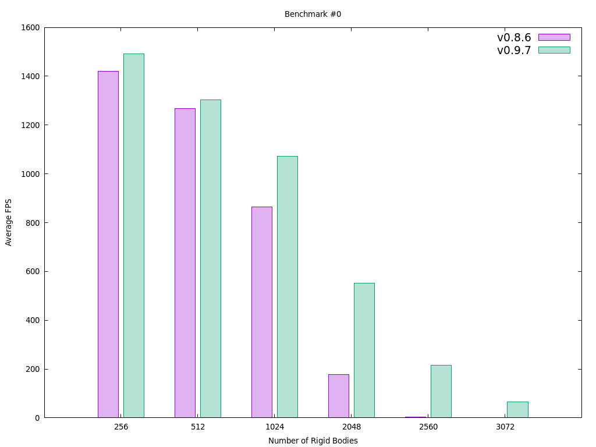
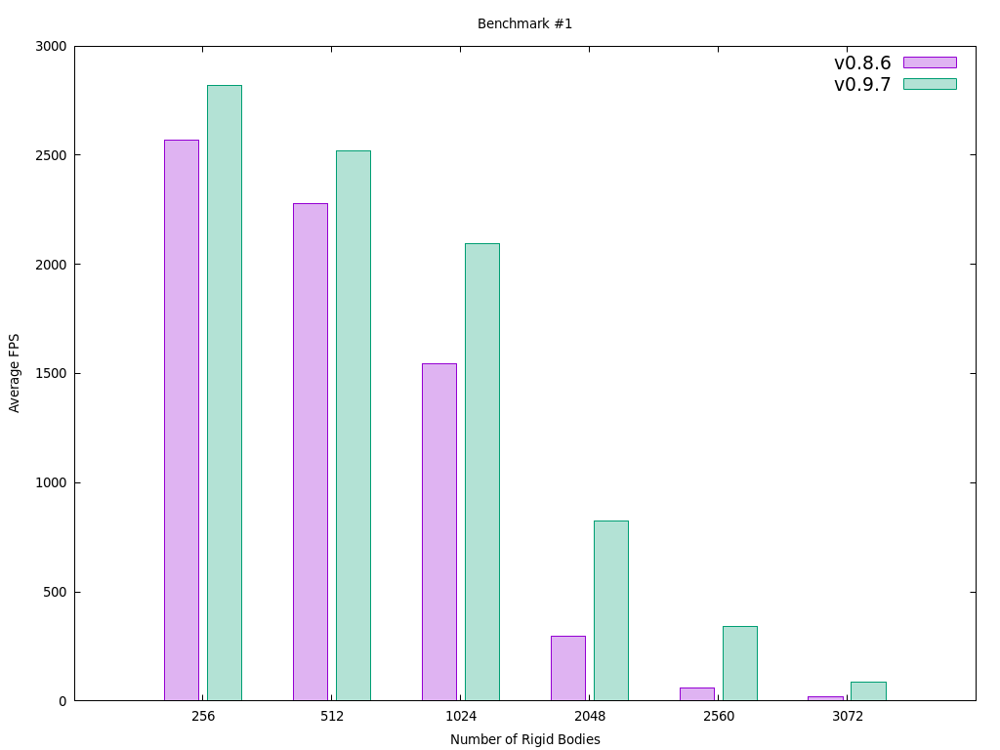

# ferox-bench

A benchmarking suite for ['ferox'](https://github.com/c-krit/ferox).

## Benchmarks

### `src/bench/smash.c`

https://github.com/user-attachments/assets/569ae753-a4aa-42ec-a21e-efd0b88ce648

### `src/bench/stacks.c`

https://github.com/user-attachments/assets/f501f19f-cd0d-4973-b475-f14f1d05f70f

## Results

<details>
<summary>Show/Hide <code>gnuplot</code> commands</summary>

```
i = 0
v1 = "v0.8.6"
v2 = "v0.9.7"

set title sprintf("Benchmark #%d", i)
set term wxt size 1024,768

set key font ",14"

set style data histograms
set style histogram cluster gap 1
set boxwidth 0.8 relative
set style fill solid 0.3

set xlabel "Number of Rigid Bodies"
set ylabel "Average FPS"

plot sprintf("%s-bench-%d.txt", v1, i) using 2:xtic(1) title v1, \
    sprintf("%s-bench-%d.txt", v2, i) using 2:xtic(1) title v2
```

</details>

### Hardware Specifications

- **CPU:** Intel® Core™ i5-1135G7
- **GPU:** Intel® Iris® Xe Graphics
- **RAM:** 16 GB

### Software Specifications

- **Platform:** Ubuntu 22.04 LTS
- **Compiler:** GCC 11.4.0
- **Profiler:** KDE Heaptrack 1.3.0
- **Renderer:** raylib 5.0.0

### Charts

<br>
<br>

## License

MIT License

> Copyright (c) 2024 Jaedeok Kim (jdeokkim@protonmail.com)
> 
> Permission is hereby granted, free of charge, to any person obtaining a copy
> of this software and associated documentation files (the "Software"), to deal
> in the Software without restriction, including without limitation the rights
> to use, copy, modify, merge, publish, distribute, sublicense, and/or sell
> copies of the Software, and to permit persons to whom the Software is
> furnished to do so, subject to the following conditions:
> 
> The above copyright notice and this permission notice shall be included in all
> copies or substantial portions of the Software.
> 
> THE SOFTWARE IS PROVIDED "AS IS", WITHOUT WARRANTY OF ANY KIND, EXPRESS OR
> IMPLIED, INCLUDING BUT NOT LIMITED TO THE WARRANTIES OF MERCHANTABILITY,
> FITNESS FOR A PARTICULAR PURPOSE AND NONINFRINGEMENT. IN NO EVENT SHALL THE
> AUTHORS OR COPYRIGHT HOLDERS BE LIABLE FOR ANY CLAIM, DAMAGES OR OTHER
> LIABILITY, WHETHER IN AN ACTION OF CONTRACT, TORT OR OTHERWISE, ARISING FROM,
> OUT OF OR IN CONNECTION WITH THE SOFTWARE OR THE USE OR OTHER DEALINGS IN THE
> SOFTWARE. 
